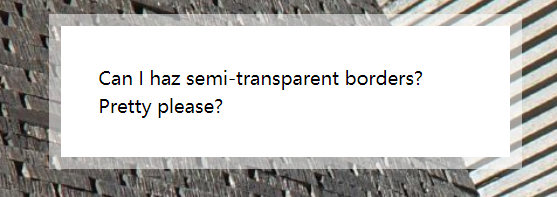
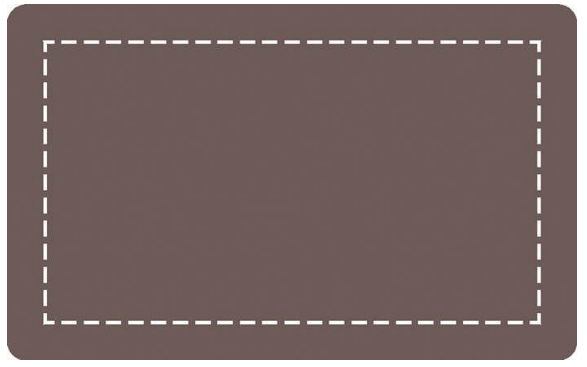
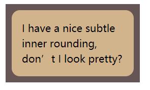
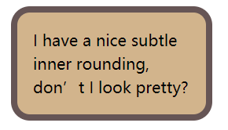
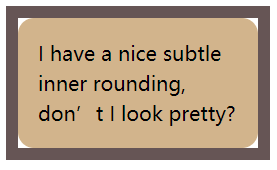
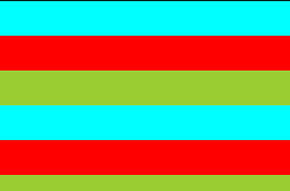
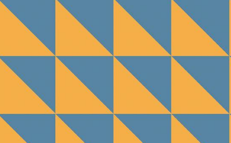

## CSS标准和CSS编码

这一节作者主要写了自己对CSS标准、编写CSS代码经验的理解。不得不说作为CSS委员会特邀嘉宾，作者对于标准的理解是很深入的，特别是对于一些历史问题。

### 关于浏览器前缀

浏览器前缀是一个糟糕的历史遗留设计，用来允许浏览器自行实现实验性的特性，能够让浏览器厂商尽早地实现并测试新功能，但被很多开发者滥用到生产环境中了。原则上来说，浏览器前缀特性是不应该用到生产环境中的。

> 用不了多久， 这个“ 坑” 里的每个人 就会意识到， 浏览器前缀已是一场史诗般的失败。最近，浏览器厂商已经很少以前缀的方式来实验性地实现新特性了。取而代之的是，这些实验性特性需要通过配置开关来启用。
>

目前仍有一些遗留的浏览器前缀属性，比较好的处理方法是使用预处理器的前缀库。而现在，一般新功能都是通过浏览器实验性模式开启，例如Chrome支持的[Web NFC](https://web.dev/nfc/)实验性功能。

### 编码规范

#### 可维护性

可维护性最大的要素是**尽量减少改动时要编辑的地方**，以下是一些技巧推荐：

* 当某些值互相依赖时，应该把它们的相互关系用代码表达出来。

  例如字号和行高有1.5倍关系时，较差的代码风格是全用绝对单位：

  ```css
  font-size: 20px; 
  line-height: 30px;
  ```

  较好的代码风格是使用相对单位和百分比

  ```css
  font-size: 125%; /* 假设级的字号是16px */ 
  line-height: 1.5;
  ```

* 审视哪些效果应该随着元素放缩一起放大或缩小，而哪些效果保持不变

  以一个圆角按钮举例，应该随着按钮大小放缩的是按钮字号、圆角半径。不应该放缩的是边框、阴影。那么我们就可以相应地使用相对单位和绝对单位。

* 使用半透明的白色或者黑色叠加在主色调上，产生色调的亮暗变色，避免自己计算颜色。

  ```css
  /* 亮色变色 */
  /* <background-color> <bg-image>*/
  background: #58a linear-gradient(hsla(0,0%,100%,. 2), transparent);
  ```

  > hsla：即色调Hue-饱和度Saturation-亮度Lightness-透明度Alpha取色法
  >
  > 对于取亮暗来说，hsla比rgba更实用。本文作者也非常喜欢这种取色法，基本上用到颜色的地方都用这种取色法。

* 代码易维护和代码量少不可兼得，以代码维护性优先。有时候需要取舍使用简写属性还是完整多条属性。

* 逻辑上的属性继承可以使用`inherit`关键字

* 使用变量，如SASS变量，以及CSS3新增的CSS变量（自定义属性）

#### 响应式设计

作者对于媒体查询的态度不是很激进，认为应该减少使用以提高可维护性和降低成本，只在其他方式失效的时候使用媒体查询。这种想法确实是比较有启发的。

> 比较常见的实践是用多种分辨率来测试一个网站，然后添加越来越多的媒体查询（Media Query）规则来修补网站在这些分辨率下出现的问题。然而对于今后的CSS改动来说，每个媒体查询都会增加成本，而这种成本是不应轻易上升的。

> **媒体查询的断点不应该由具体的设备来决定**，应该根据设计自身来决定。

如何用尽量少的媒体查询去实现响应式设计呢？作者给了这么几个建议：

* 使用百分比和`vw`、`vh`等视口单位来取代固定长度+媒体查询
* 使用max-width而不是width+媒体查询来实现在较大分辨率下得到固定宽度的设计
* 为替换元素设置一个max-width，配合`width:100%`来实现自适应
* background-size: cover就可以用来实现背景图片完整铺满容器，不管容器的尺寸变化如何，而不用媒体查询去更改背景图片属性
* 行列式布局时，让视口的宽度决定列数量，而不是指定绝对数量。flex-box和display: inline-block都可以做到这一点
* 使用多列布局可以简单地设计响应式多列文本，但需要前缀，因为这个特性还是实验状态。如（-webkit-column-width）

> “结果我们发现，想让网页在一堆不同的设备上合理展示，只需要在最终产品上添加一点CSS媒体查询就可以了。这件事情之所以这么简单，关键在于**我们的布局原本就是弹性可伸缩的**。因此，优化网页在小屏幕上的表现，其实只意味着把一些外边距收拢到最小程度，然后把因为屏幕太窄而无法显示成双列的侧栏调整为单列布局而已。”
>

#### 合理使用简写

展开式写法不会清空所有的相关属性，举例来说，以下代码在效果上有一定的差别：

```css
background: aliceblue;
background-color: aliceblue;
```

第一个写法可以确保得到淡蓝色背景，而第二个写法只是设置了background-color，而可能被background-image等属性覆盖视觉效果。

#### 合理取舍预处理器

预处理器确实可以让CSS代码更加灵活，但也会造成一些问题。这方面来说，作者是建议在大型项目中使用预处理器。另外，还提到了CSS本身的一些正在发展的功能可以取代部分预处理器功能，如CSS-Variable。

## 背景与边框

在之后的章节就是具体的CSS问题集合，每个问题作者都已经提供了playground，强烈建议看一看。

### 透明边框



* 描述：透明边框的效果如上图。由于默认背景延伸至边框，直接设置透明边框不起效果，必须要使用background-clip来限制背景只延伸至padding。

    相关属性：background-clip，hsla
* [playground](https://dabblet.com/gist/012289cc14106a1bd7a5)

    ```css
    border: 10px solid hsla(0,0%,100%,.5);
    background: white;
    background-clip: padding-box; /* 如果没有此属性，将不能设置透明边框 */
    ```

### 多重边框


* 描述：CSS边框(border)在设计上只允许单边框，在CSS3中，我们可以使用box-shadow来实现多边框，而不用像CSS2时代使用图片边框来解决多边框问题。
* 相关属性：box-shadow, border, outline, outline-offset
* [playground](https://dabblet.com/gist/525eb8e9cdade71723c1)

    ```css
    box-shadow: 0 0 0 10px #655,
                0 0 0 15px deeppink,
                0 2px 5px 15px rgba(0,0,0,.6);
    ```

* 其他解决方案：还有另外一种解决思路是使用outline+border做二层边框。这种方案只能解决两层边框问题。但有点是outline和border都可以设置边框样式，而box-shadow不行。另一个好处是outline可以使用outline-offset来精确控制第二层边框的位置，甚至可以设置为一个负值，实现内缝边：



### 精确定位背景图片


* 描述：在CSS2时代想要精确定位背景是很难的，只能指定距离左上角的偏移量，或者靠齐到另外三个角。CSS3对于background-position的语法进行了扩展，允许靠齐时再定义一个偏移量。就可以实现相对于四边的定位。

* 相关属性：background-position, background-origin,calc()

* [playground](https://dabblet.com/gist/0f226e63595d1bef88cb)

    ```css
    background-position: right 20px bottom 10px;
    ```

* 其他解决方案1：CSS2时代background-position的定位只能相对于padding-box，而CSS3新增属性background-origin可以修改这种行为。我们可以通过修改内边距从而定位背景图片。这种方案比较诡异，而且设置内边距还有影响内部文本排版，我觉得非常的不好。但作者写在这了我也记录一下。

  ```css
  background: url(http://csssecrets.io/images/code-pirate.svg)
  	            no-repeat bottom right #58a;
  background-origin: content-box;
  ```

* 其他解决方案2：使用calc可以自动计算位置。

    ```css
    background-position: calc(100% - 20px) calc(100% - 10px)
    ```

### 边框内圆角



* 描述：内圆角是一种比较特殊的多重边框，通常来说用两个元素实现会比较简单。如果要用一个元素实现呢？还是可以使用多重边框的思路，使用border+box-shadow+outline即可。为什么会需要三个属性一起用呢？因为box-shadow会贴合圆角，而outline不会。光用box-shadow会造成这样:

  

  而光用outline会这样：

  

* 相关属性：border, box-shadow, outline

* [playground](https://dabblet.com/gist/170fe436f290083cc24c)

### 条纹背景



* 描述：条纹背景可以简单地用svg或图片实现，那可不可以用纯CSS实现呢？有一种比较hack的方法：当线性渐变色标位置重合时，将会变成纯色组成的条纹图片。由于线性渐变生成的图像等价于图片，我们可以使用background-size可以控制一次生成的条纹宽高，然后使用background-repeat: repeat使得条纹重复出现

  ```css
  background: linear-gradient(aqua 33.3%, red 0, red 66.6%, yellowgreen 0);
  background-size: 100% 100px;
  ```

  这里用到了一个0值小技巧：

  > 如果某个色标的位置值比整个列表中在它之前的色标的位置值都要小，则该色标的位置值会被设置为它前面所有色标位置值的最大值。

  用这个技巧可以让我们在以后修改时只需要修改更少的代码，提高了可维护性。

  这种方法对于生成垂直和水平条纹很有效，但如果要生成斜向的条纹，就很艰难了，因为斜向条纹需要多块条纹背景拼接。如果像生成垂直和水平条纹那样用单纯的一个条纹图像重复会造成这样的困境：

  

  这种情况下，要么就勾股定律算一算然后玩拼图。但我感觉还是做个背景图片比较简单吧，毕竟线性渐变不是专门用来做这个玩意的。

* 相关属性：background, background-size, linear-gradient

* [playground](https://codepen.io/excitedqe/pen/JjGyrKx) 这里是我自己写的，因为作者提供的url出问题了


