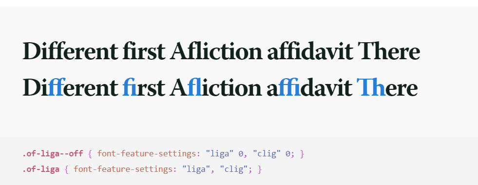
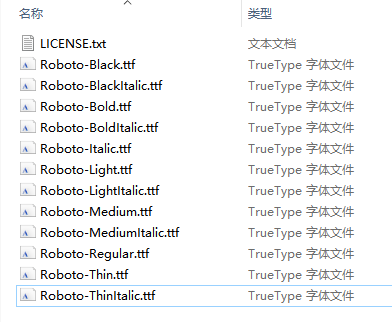
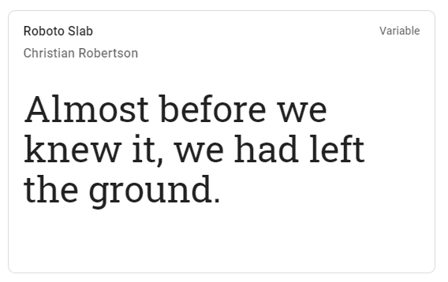
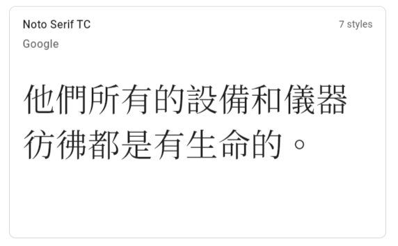
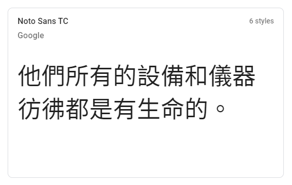
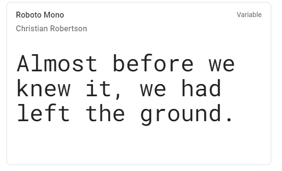
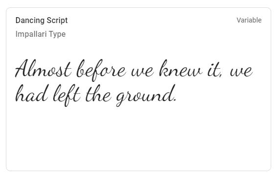
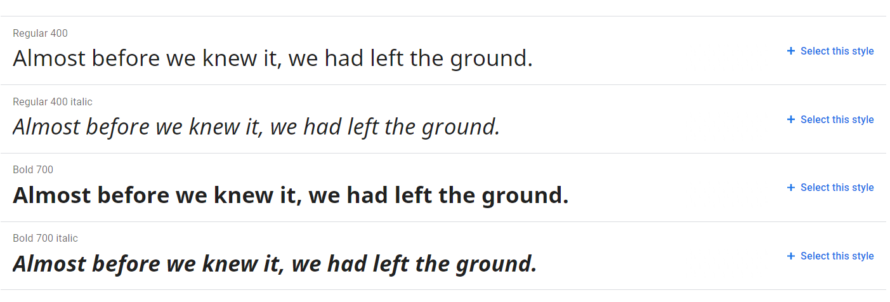
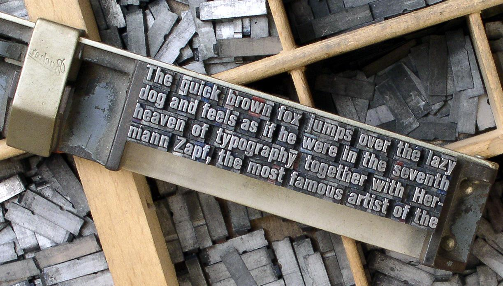
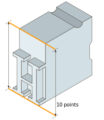

## 计算机字体

 我们都知道计算机是二进制机器。而计算机字体则是计算机能够渲染文字的方式。计算机字体根据其类型，用不同的方式存储字型（glyphs）、符号（symbols）等数据，用于计算机渲染对应的文字。

* 点阵字体 Bitmap Font

  字符集用点阵图片集表示，也是人类最早实现的计算机字体形式。计算机渲染很简单。但缩放效果很差。低分辨率情况下效果不错，但高分辨率情况下锯齿感严重。目前仅在一些控制台上使用，以及一些字体在低分辨率下的回退字体。

  * 五号宋体 1080p表现：

  

  * 点阵字体的缩放：

  

  

* 轮廓字体 Outline font

  字符集由向量图集。表示用函数向量描述字体。适应缩放。相比点阵字体，渲染需要额外的算力（将向量映射为像素点阵、去锯齿）。因为和SVG原理很相似，所以也有了很多图形的支持，如emoji、icon fonts。由于轮廓字体在低分辨率下容易产生模糊，所以部分字体是提供了低分辨率回退的点阵字体。

  * PostScript - Adobe：先行者，但受到 Adboe 的封闭约束

  * **TrueType** - Apple Inc：最常用

    * .ttf .tte

  * OpenType - Microsoft & Adobe：在TrueType基础上拓展功能，如连笔效果、花体效果。

    * .otf, .otc

      

  * Variable Fonts：提供给其他开发者的字体“API”

  * Web Open Font Format（woff）：TrueType和OpenType的Web开放形式。

* 笔画字体 stroke font

  提供笔画路径（stroke paths）而非字型轮廓（outline）的字体形式。可以用不同的笔画填充方法生成不同的字型。在一些特殊的排版如auto CAD、以及字体二次开发中使用

  

## Web Font

计算机字体的一个应用则是应用到web网页中显示文字内容，这种应用场景一般俗称web font。Web 标准中的字体和文字排版有一套独有的规范。

### 字体族

通常使用的truetype字体都不是由一个单独字体向量图片集构成的。往往是由多个字体变形组合而成。我们下载字体的时候也是下载的多个字体变形：



为了统一字体的引用，web标准中有一个字体族（font-family，下文还会细讲）的概念。我们先指定字体族，再根据其他配置项（CSS属性）来选择实际展示的字体。当没有指定任何其他有关的CSS属性、特殊的浏览器设置的情况下，通常使用Regular字体来表现。

### 通用字体

通用字体不是指哪一个字体，而是一个类字体。将网页中的字体应用为通用字体是往往是作为一种最保险的形式，因为任何操作系统在发行时，至少都提供了每个通用字体中的一个。当我们使用通用字体，浏览器会自动去寻找用户已安装字体中符合条件的字体，但找到哪种字体就不能受控了。

* serif：衬线字体

  

  

* sans-serif：无衬线字体

  

  

* monospace：等宽字体

  

* cursive：手写字体

  

* fantasy：剩下无法归类的长得比较艺术的字体

### font-family

font-family 是用来为页面设置字体的基本CSS属性。对于设计师来说，虽然不会去写CSS代码，但是懂得font-family对于理解不同平台上字体如何显示也是很重要的。

web开发和桌面开发、app开发在字体方面不同的是，我们制作页面时，我们无法控制用户使用的操作系统安装了什么字体，为用户安装字体也是代价非常高昂的，但是：

* 我们想提供给用户统一的字体体验
* 进一步，我们希望我们做的页面符合用户使用的操作系统的统一感，在windows上看见苹方、mac上看见雅黑还是挺突兀的。

万幸，font-family 是一个可以“fall back”的属性：

> Font selection *does not* simply stop at the first font in the list that is on the user's system. Rather, font selection is done *one character at a time*, so that if an available font does not have a glyph for a needed character, the latter fonts are tried. 
>
> ——mdn font-family

所以，我们可以给出一个优先级序列，让浏览器去一一匹配，最后得到一个可用的字体。

我们可以参考天猫tmall.com的font-family设置：

* PC端（windows）:

  ```css
  font-family: "Microsoft YaHei",SimSun,'宋体',sans-serif
  ```

  前三个是具体的字体样式，最后是一个通用的无衬线通用字体。可以看出，天猫对Windows PC端的字体也是尽量贴近系统原生，优先级分别为：微软雅黑、宋体。我们可以推测出其表现为：

  * win7 ~ win10: 微软雅黑
  * win xp ~ win vista：新宋体或宋体（取决于用户安装的是哪个具体版本）
  * sans-serif：如果是非常奇怪的windows版本或者自己删除了自带字体，至少保证页面显示为无衬线字体

  这是典型的衬线和无衬线混用了，我觉得是有点为了与操作系统的体验一致而放弃了页面的跨平台体验。。。

* 移动端font-family：

  ```css
  font-family: "PingFang SC",miui,system-ui,-apple-system,BlinkMacSystemFont,Helvetica Neue,Helvetica,sans-serif
  ```

  移动端的font-family更加丰富了。因为移动端提供方为了优化自己的体验，提供了很多的通用字体。如这里面的：

  * "PingFang SC"：苹方
  * miui： 小米手机浏览器调用小米手机的系统字体 
  * system-ui：调用系统字体的字体
  * -apple-system、BlinkMacSystemFont：老版本safari 和 firefox 调用苹果手机的系统字体
  * Helvetica Neue 和 Helvetica：都是西文字体 helvetica，前者有更多的字重，所以前者优先使用
  * sans-serif： 无衬线字体

  所以感觉来看，是优先苹果和小米手机、然后服务高版本浏览器。如果是安卓手机、浏览器版本又低到识别不了`system-ui`，中文字体就直接掉出到不受控的 sans-serif了。所以天猫h5的 font-family 我认为也并不算完美。

我们是怎么做的？

> 待补充，人没在内网

### 当我们设置XXX的时候，我们在设置什么？

#### 字重

我们设置字重，实际上是在这个字体族里面**选择一个字体变形**。

web标准中的字重为100~900 9个档次。但并不是所有的字体都提供了九种字重变形（roboto 6种）。当设置为不存在的字重字体变形的时候，将会按照一定的规则选择一个相似的字体变形：

- 如果所需的字重小于400，则首先降序检查小于所需字重的各个字重，如仍然没有，则升序检查大于所需字重的各字重，直到找到匹配的字重。
- 如果所需的字重大于500，则首先升序检查大于所需字重的各字重，之后降序检查小于所需字重的各字重，直到找到匹配的字重。
- 如果所需的字重是400，那么会优先匹配500对应的字重，如仍没有，那么执行第一条所需字重小于400的规则。
- 如果所需的字重是500，则优先匹配400对应的字重，如仍没有，那么执行第一条所需字重小于400的规则。

这也就是为什么往往在很多情况下字重不同，但是渲染出来的字体是相同的。

例如，字体 noto sans 仅有两种字重：400、700



当设计用多种字重强调内容时，要关注用户使用的字体族是否能够支持这么多的变形。

在一些比较现代化的浏览器和其他渲染平台中，会支持字体合成功能（[font-synthesis](https://developer.mozilla.org/zh-CN/docs/Web/CSS/font-synthesis)）。这种能力会根据一定的图形处理算法，模拟成对应缺失的粗体和斜体。但是具体选择哪种图像处理算法则没有固定的规范，这就导致了可能不同浏览器和平台模拟的粗体和斜体差别较大，导致这个功能仅能够作为一种回退机制来使用。

#### 字体大小

一个很有趣的事实是，我们设置相同字体大小（font-size）的字体，往往会表现出来不同的尺寸。


要解释这个问题，我们需要了解一下技术上字体是如何开发的。

让我们回到印刷时代，可以发现所有字符的容器其实是一样大的，这样才能搞活字印刷。





在计算机字体上，字体开发同样采用了这个概念。同一个字体，其容器的相对大小是一样的。这个容器我们一般称其为em（em-square）。设置字体大小实际上是设置这个母版em的大小。

> 1font-size = 1em

但是，字体开发中并没有规范这个em容器的大小究竟如何确定，它只是一个相对度量。那么不同字体的字型与em容器的大小比例就不相同，所以最后显示出的相同font-size就有不同的实际大小。

em的概念不仅用在这里，同样在web设计中还引申出[相对单位em](https://developer.mozilla.org/en-US/docs/Learn/CSS/Building_blocks/Values_and_units#Relative_length_units)的概念。还是这个相同的公式，倒过来就是其实际的意思：

>  1em = 1font-size

当我们设置一个按钮的高度为2em，也就是说我们其实是设置它的高度是两倍的根元素font-size大小。因为PC、移动端的设计规范，我们常常需要改变基础字体大小。当我们改变基础字体大小时，这个按钮的高度就会随之改变，这是一种非常响应式的能力。

#### 行高

在标准中，行高代表文本行基线之间的距离，但我们为了方便理解，也可以认为是单行文本框的高度。一个恰到好处的行高会提供非常好的阅读体验。WCAG认为，一个良好的无障碍访问页面的行高需要在字体大小的1.5倍以上。

行高还有一个比较特殊的特性：垂直居中性。也就是说，当行高大于字体高度（行框高度）的时候，实际上文字和其他行内元素将会垂直居中。这个是可能设计师注意不到的一个小点。

>  也因为这个特性，有些垂直居中效果是用line-height就可以实现。现在很多博客的写的是单行文本垂直居中line-height=height，实际上不需要设置height，line-height也可以把行高撑高；也不仅仅是单行文本可以使用这个方式实现居中，请看这个[例子](https://codepen.io/excitedqe/pen/LYNbwPW)

在web平台中，行高实际上是可以指定为倍数的。例如文字大小16px，行高24px。实际上就可以写成行高1.5倍：

```css
line-height: 1.5
```

这样的写法，除了能够更加直接地表现文字大小和行高的关系，还可以避免一些行高属性继承所带来的潜在缺陷。所以各种 Web UX 规范中都推荐写倍数行高。

> 当使用倍数行高，也会遇到有可能1倍行高，但是文字却重叠的情况。这个的原因在上面字体大小章节讲的排版原理是一样的。

### 文字排版的实践

以下是一些比较好的文字排版的实践：

* 行高在1.4到1.8之间
* 一行最多70-80个字符（西文），中文约为1/2即可
* PC端文字大小不小于16px
* 较小的字体需要更大的字符间距
* 引用可以使用较小的字符间距W
* 行高最好与字符大小有线性关系

